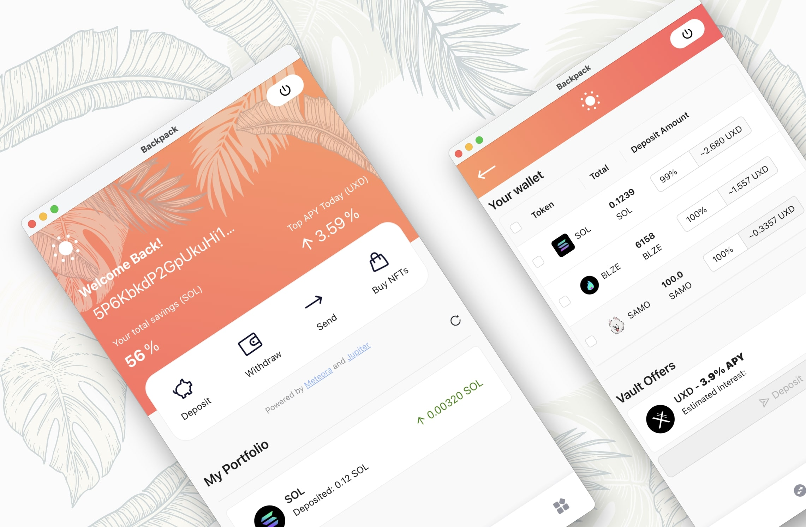
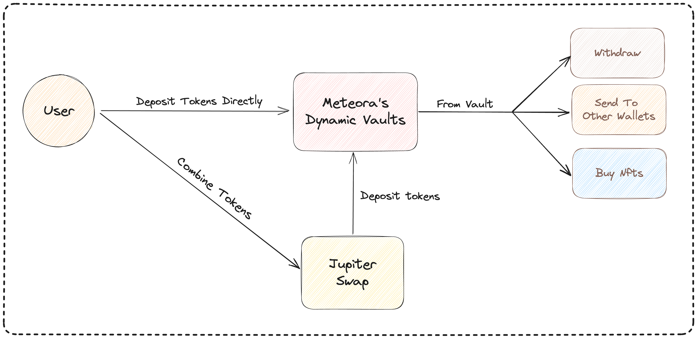

# Solis

Solis is an xNFT application built on top of [Backpack](https://www.backpack.app/) that helps users leverage their assets while earning yields.



## Features
- Earning yields on your idle capital with 1-click
- Automatically combine and swap multiple tokens before deposit
- Send tokens and buy NFTs instantly from your savings

## User Flows


## How it works

When users deposit their assets from [Backpack](https://www.backpack.app/) into Solis app, we use [Jupiter](https://jup.ag/) to automatically convert user assets to [Meteora](https://meteora.ag/) token vaults.

User assets after deposit will be automatically monitored and earned yields thanks to Meteora's Dynamic Vaults. After that, users can leverage tokens in vaults to perform on-chain activities such as transferring tokens to other wallets or buying NFTs.

## Local development

First, install dependencies.

```
yarn install // For xNFT app
cd backend && yarn install // For backend
```

### Run the dev server

Then, run the dev server with hot reloading

```
yarn dev
cd backend && yarn dev
```

### Open the Simulator in Backpack

Now that you have your xNFT dev server running, open it in the Backpack simulator to see it run.

That's it!


### Build & Publish

Once you're done and ready to publish, build your xNFT:

```
yarn build
```

Test the newly created build in `dist/index.html` in the simulator:

```
yarn start
```
